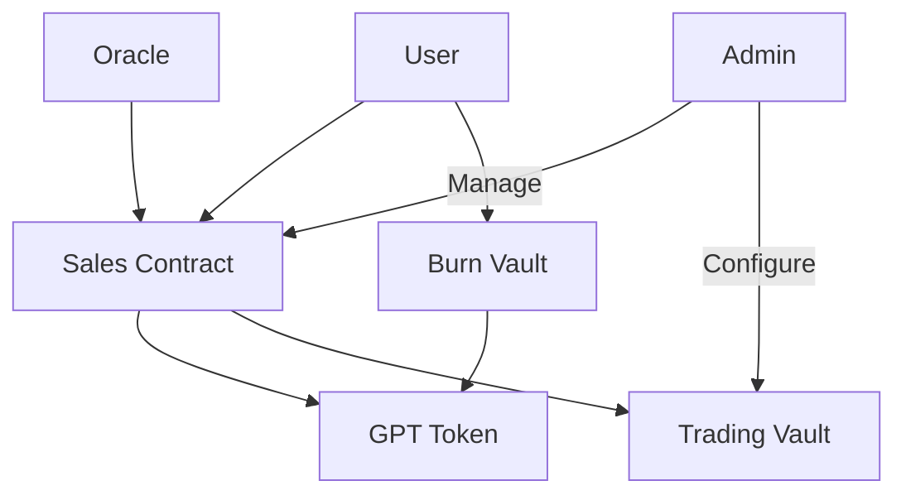

# GoldPack Token & Gold Stable Yield Token Contracts

A set of smart contracts for managing the sale, minting, and burning of Gold Pack Tokens (GPT), including secure vaults and price calculation integration. This project leverages the Hardhat framework for testing and deployment.

---

## Overview

This repository contains a suite of contracts and a utility library for managing a gold-backed ERC20 token (GPT), handling sales stages, secure withdrawals, token burning, and price calculations. Each contract is designed with upgradeability, security, and role-based access control.

The contracts included:

1. **GPT Contract**: A gold-backed ERC20 token with minting and burning capabilities.

   - UUPS upgradeable pattern
   - Role-based access control (Super Admin, Admin, Sales roles)
   - Decimal precision: 18
   - Transfer restrictions during setup

2. **Sales Contract**: Manages the sales of GPT tokens across different sale stages.

   - Pre-sale functionality with whitelist
   - Public sale with signature verification
   - Round-based sales management
   - Dynamic pricing using Chainlink oracles
   - Integration with TradingVault for payment custody

3. **BurnVault**: Provides a time-delayed token burning vault.

   - Controlled burning process
   - Role-based access for burn operations
   - Detailed event tracking
   - Integration with GoldPackToken

4. **TradingVault**: A vault for managing withdrawals.

   - Delayed withdrawal mechanism with configurable timelock
   - Threshold-based approval system
   - Safe wallet integration for secure storage
   - Emergency pause functionality
   - Multi-signature support
   - Token whitelist management

5. **RewardDistribution**: Handles reward distribution to stakeholders.

   - Shareholder management with shares tracking
   - Configurable distribution periods
   - Locking mechanism for shares
   - Claim tracking and verification
   - Multiple reward token support

6. **Libraries**:
   - **CalculationLib**: GPT and payment token calculations
   - **SalesLib**: Purchase processing and validation
   - **LinkedMap**: Ordered key-value data structure
   - **Errors**: Custom error definitions

---

## Key Features

- **Gold-Backed Tokenization**: Each GPT token represents a fractional ownership of physical gold
- **Multi-Layer Security**: Comprehensive security measures including RBAC, time-locks, and multi-sig
- **Oracle Integration**: Real-time gold price feeds via Chainlink
- **Flexible Sales Mechanism**: Supports both pre-sale and public sale phases
- **Automated Reward Distribution**: Built-in mechanism for distributing rewards to stakeholders

## Architecture



---

## Security Features

- Role-based access control (RBAC)
- Multi-signature requirements
- Time-locked operations
- Emergency pause functionality
- Threshold-based controls
- Price feed freshness checks
- Round allocation limits
- Reentrancy protection
- SafeERC20 implementation
- Upgradeable security patterns

---

## Detailed System Operations

### Price Calculations

#### GPT Token Purchase Calculation

```solidity
// For buying GPT with payment tokens (e.g., USDC)
paymentAmount = (goldPrice * gptAmount) / (tokenPrice * tokensPerTroyOunce)

Where:
- goldPrice: Current gold price per troy ounce (8 decimals)
- gptAmount: Desired amount of GPT tokens
- tokenPrice: Payment token price in USD (8 decimals)
- tokensPerTroyOunce: GPT tokens per troy ounce (e.g., 10000)

Example:
Gold Price = $2000 (200000000000)
USDC Price = $1 (100000000)
GPT Amount = 100 tokens
TokensPerTroyOunce = 10000

Payment Amount = (2000 * 100) / (1 * 10000) = 20 USDC
```

#### Reverse Calculation (GPT from Payment)

```solidity
gptAmount = (paymentTokenAmount * tokenPrice * tokensPerTroyOunce) /
            (10^tokenDecimals * goldPrice)

Example:
Payment Amount = 20 USDC (20000000 - 6 decimals)
USDC Price = $1 (100000000)
Gold Price = $2000 (200000000000)
TokensPerTroyOunce = 10000

GPT Amount = (20000000 * 100000000 * 10000) / (1000000 * 200000000000) = 100
```

### Error Handling Scenarios

#### Price Related Errors

```solidity
// Invalid or stale prices
if (goldPrice <= 0) revert InvalidGoldPrice();
if (tokenPrice <= 0) revert InvalidTokenPrice();
if (block.timestamp - priceUpdatedAt > 24 hours) revert TokenPriceStale();

// Amount validation
if (gptAmount == 0) revert AmountCannotBeZero();
if (tokensPerTroyOunce == 0) revert InvalidTroyOunceAmount();
```

#### Sales Process Errors

```solidity
// Round validation
if (round.tokensSold + gptAmount > round.maxTokens)
    revert ExceedMaxAllocation();

// Whitelist checks
if (!isWhitelisted[msg.sender]) revert NotWhitelisted();

// Signature verification
if (!isValidSignature(order, signature))
    revert InvalidSignature();
```

#### Vault Operation Errors

```solidity
// Withdrawal checks
if (amount > withdrawalThreshold)
    revert ExceedsThreshold();
if (block.timestamp < withdrawalTime)
    revert WithdrawalNotReady();
```

### Contract Interaction Examples

#### Pre-sale Purchase

```typescript
// 1. Check whitelist status
const isWhitelisted = await salesContract.isWhitelisted(buyerAddress);

// 2. Calculate payment amount
const gptAmount = ethers.utils.parseEther('100');
const paymentAmount = await salesContract.calculatePaymentAmount(gptAmount, usdcAddress);

// 3. Approve USDC spending
await usdc.approve(salesContract.address, paymentAmount);

// 4. Execute purchase
await salesContract.preSalePurchase(gptAmount, usdcAddress);
```

#### Public Sale Purchase

```typescript
// 1. Prepare order
const order = {
  buyer: buyerAddress,
  gptAmount: ethers.utils.parseEther('100'),
  paymentToken: usdcAddress,
  nonce: await salesContract.nonces(buyerAddress),
};

// 2. Get signature from backend
const signature = await getSignatureFromBackend(order);

// 3. Approve USDC
const paymentAmount = await salesContract.calculatePaymentAmount(
  order.gptAmount,
  order.paymentToken,
);
await usdc.approve(salesContract.address, paymentAmount);

// 4. Execute purchase
await salesContract.authorizePurchase(order, signature);
```

### Round Management System

#### Round Structure

```solidity
struct Round {
  uint256 startTime; // Round start timestamp
  uint256 endTime; // Round end timestamp
  uint256 maxTokens; // Maximum tokens for the round
  uint256 tokensSold; // Tokens sold in the round
  bool isPreSale; // Whether this is a pre-sale round
  bool initialized; // Round initialization status
}
```

#### Round Operations

##### 1. Round Initialization

```typescript
await salesContract.initializeRound(startTime, endTime, maxTokens, isPreSale);
```

##### 2. Round Status Checks

```typescript
// Check if round is active
const isActive = await salesContract.isRoundActive();

// Get current round info
const round = await salesContract.getCurrentRound();
```

##### 3. Round Transitions

```typescript
// Move to next round
await salesContract.moveToNextRound();

// Emergency round pause
await salesContract.pauseRound();
```

#### Round Validation

- Checks round timing
- Validates token availability
- Enforces round-specific rules (pre-sale vs public)
- Tracks token sales within round limits

---

## Setup and Installation

### Prerequisites

1. **Node.js**: v18.x or later
2. **npm**: v9.x or later

### Installation Steps

1. **Clone Repository**:

   ```bash
   git clone https://github.com/Mizzle-Technology/GPT-GST-Contracts.git
   cd GPT-GST-Contracts
   ```

2. **Install Dependencies**:

   ```bash
   npm install
   ```

3. **Environment Setup**:
   Create a `.env` file:

   ```env
   # Network RPC URLs
   MAINNET_RPC_URL=your-mainnet-url
   SEPOLIA_RPC_URL=your-sepolia-url

   # Private Keys (for deployment)
   PRIVATE_KEY=your-private-key

   # API Keys
   ETHERSCAN_API_KEY=your-etherscan-key

   # OpenZeppelin Defender
   DEFENDER_API_KEY=your-defender-api-key
   DEFENDER_API_SECRET=your-defender-api-secret
   ```

### Development Commands

```bash
# Compile contracts
npm run compile

# Run tests
npm test

# Run specific test
npm test test/GoldPackToken.test.ts

# Generate coverage report
npm run coverage

# Deploy to testnet
npm run deploy:sepolia

# Verify contracts
npm run verify:sepolia
```

### Project Structure

```bash
contracts/
├── tokens/
│   └── GoldPackToken.sol
├── sales/
│   └── SalesContract.sol
├── vaults/
│   ├── BurnVault.sol
│   └── TradingVault.sol
├── rewards/
│   └── RewardDistribution.sol
├── libs/
│   ├── CalculationLib.sol
│   ├── SalesLib.sol
│   ├── LinkedMap.sol
│   └── Errors.sol
└── interfaces/
    ├── IGoldPackToken.sol
    ├── ISalesContract.sol
    └── [other interfaces]

test/
├── GoldPackToken.test.ts
├── SalesContract.test.ts
└── [other test files]

scripts/
├── deploy.ts
└── verify.ts
```

---

## Testing

### Run Tests

```bash
npm run test
```

### Coverage

```bash
npx hardhat coverage
```

---

## Deployment

### Using OpenZeppelin Defender

```typescript
const gptProxy = await upgrades.deployProxy(GoldPackTokenFactory, [superAdmin, admin, sales], {
  kind: 'uups',
  defender: {
    useDefenderDeploy: true,
  },
});
```

### Networks Supported

- Ethereum Mainnet
- Sepolia Testnet
- Local Development Network

---

## Dependencies

- "@openzeppelin/contracts-upgradeable": "^5.0.0"
- "@openzeppelin/hardhat-upgrades": "^2.0.0"
- "@chainlink/contracts": "^0.8.0"
- "hardhat": "^2.19.0"

---

## License

This project is licensed under the MIT License.

## Audit Status

- Initial audit completed by [Audit Firm Name] on [Date]
- No critical vulnerabilities found
- All medium severity issues addressed
- Regular security reviews scheduled

## Gas Optimization

The contracts implement several gas optimization techniques:

- Strategic use of immutable variables
- Packed storage slots
- Minimal storage operations
- Efficient loop handling
- Optimized event emissions

## Contribution Guidelines

1. Fork the repository
2. Create a feature branch
3. Commit your changes
4. Push to the branch
5. Create a Pull Request

Please ensure:

- Tests pass
- New features include tests
- Documentation is updated
- Code follows style guide
